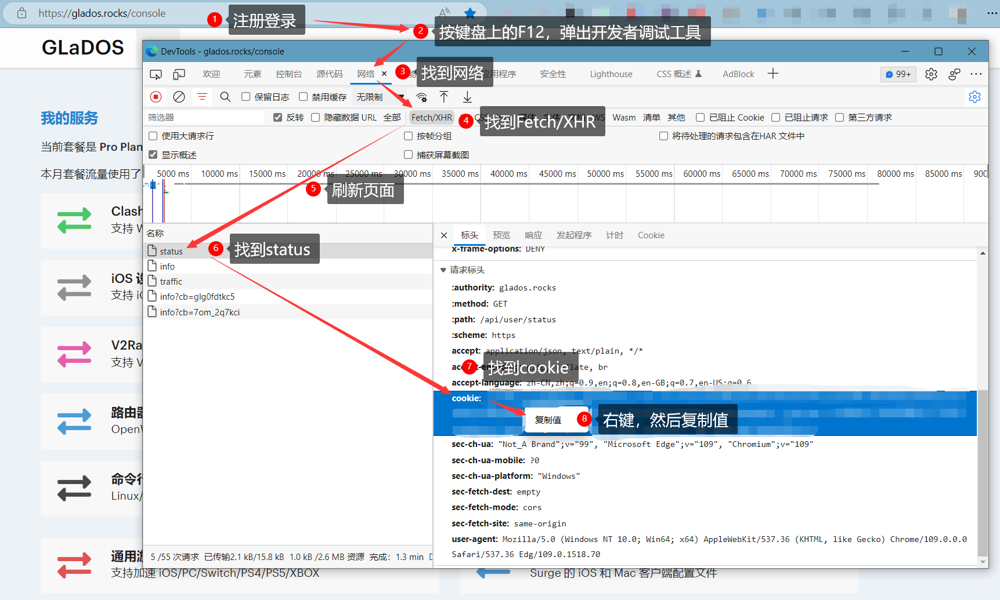
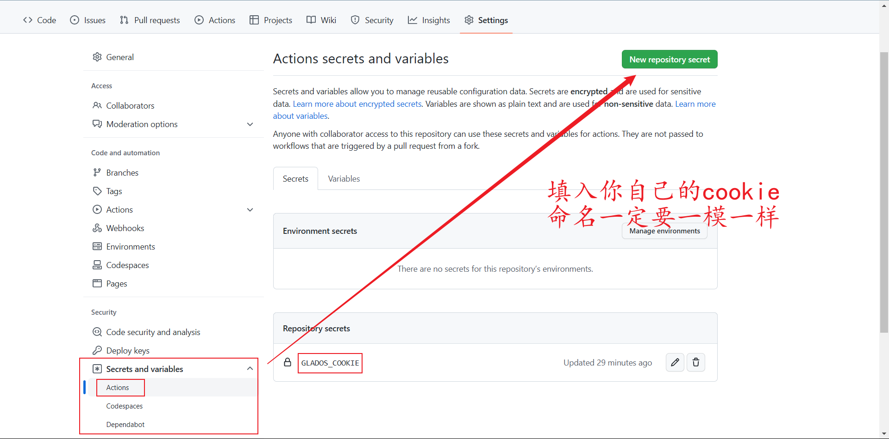

# <font color="red">GLaDOS-CheckIn</font>
！！！  

之前忘了把自己的pushPlus的token删掉，导致都推送到我这儿了，各位重新Fork代码吧。(擦汗)  

！！！  

## 1. 说明

GLaDOS代理自动签到  
利用GitHub的Actions功能实现GLaDOS的每天自动签到，具体签到结果可以在Actions中看到  
利用[Server酱](https://sct.ftqq.com/)或者[pushPlus](https://www.pushplus.plus/)将签到结果推送到微信  

```bash
# 项目地址
https://github.com/ChenAi140/GLaDOS-CheckIn
```
每天 <font color="red">20:05</font> 开始排队签到，具体签到时间以GitHub延迟为准  
经过本人测试，大概签到时间为早上 04:20 左右，建议大家适当修改时间，防止意外  
如需修改签到时间[点击此处](./.github/workflows/GLaDOS_CheckIn.yml)，打开文档，自行修改cron表达式，不会自行百度  

## 2. 注册GLaDOS

[GLaDOS注册入口](https://github.com/glados-network/GLaDOS)  

我的邀请码：AZDOF-3654G-EBHR4-O79MD  
填写邀请码双方互利  
工具推荐使用Clash  
[Clash for Windows](https://github.com/Fndroid/clash_for_windows_pkg/tags)  --->  [汉化补丁，可能有广告](https://github.com/BoyceLig/Clash_Chinese_Patch)  
[Clash for Android](https://github.com/Kr328/ClashForAndroid/tags)  

## 3. Github-Actions每天自动签到教程

1. Fork此仓库  

2. 获取GLaDOS的cookie  
   
    有些浏览器可能显示的英文，但都大差不差，若图片未显示，则需要使用魔法或者解决DNS污染  
    
      

3. 将cookie填入`Settings` -> `Secrets and variables` -> `Actions` -> `Repository secrets`中，命名一定要是`GLADOS_COOKIE`  
   
      

## 4. 配置微信推送(非必须)

可以不配置，可以只配置其中一个，也可以都配置  

### 4.1 Server酱

和配置cookie一样的方式，将Server酱中的SendKey复制到`Repository secrets`命名为 `SENDKEY`  
[Server酱](https://sct.ftqq.com/)  
暂时只支持`方糖服务号`进行推送(因为懒)  
若此通道被弃用，那到时候再说吧  

### 4.2 pushPlus

和配置cookie一样的方式，将pushpuls微信公众号中的token复制到`Repository secrets`命名为 `TOKEN`  
[pushPlus](https://www.pushplus.plus/)  

## 其它  
如果需要更新代码，可以重新Fork此仓库  
或者在电脑中安装 [Git软件](https://git-scm.com/) ，然后运行脚本`Pull_From_Origin.bat`一键更新  

最后，求个小小的star  
QWQ  
